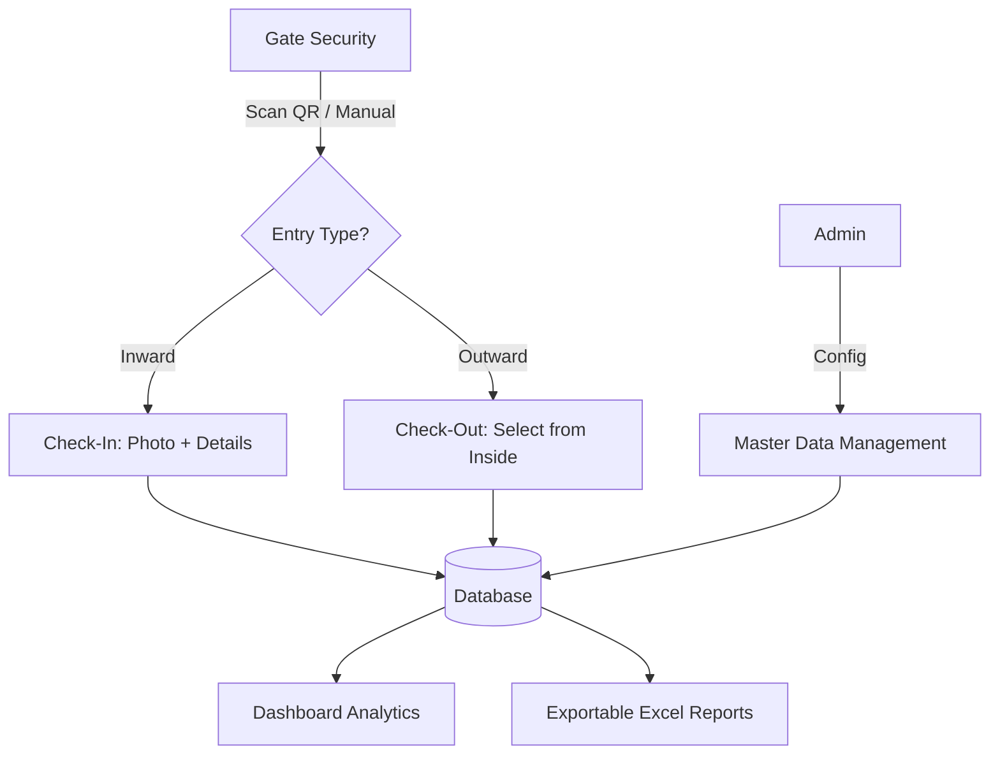

# System Architecture: GatePilot Platform

## 🏗️ High-Level Architecture
The **GatePilot Platform** is built on a robust, mobile-first monolith architecture designed for high availability and ease of deployment. It follows a multi-tier structure comprising a Presentation Layer, Business Logic Layer, and Data Tier.

### 1. Presentation Layer (Frontend)
- **Web Application**: Developed using **HTML5, CSS3 (Mobile-First), and Vanilla JavaScript**. It uses **Bootstrap 5** for responsive layouts and premium aesthetics.
- **Mobile Application**: A **Flutter-based Hybrid App** (WebView Wrapper) that provides a native experience on Android and iOS. It handles hardware permissions (Camera, Location) and provides an offline-first container for the web interface.
- **Dynamic UI**: Uses asynchronous JavaScript (AJAX) for real-time data fetching, QR scanning, and interactive dashboard updates.
- **Form Modules**: Specialized forms for **Vehicle Loading/Unloading Checklists** with strict validation against gate entry status.

### 2. Business Logic Layer (Backend)
- **Core Engine**: Built with **PHP 7.4+**. A centralized routing system manages authentication, role-based access control (RBAC), and session management.
- **Service Modules**:
    - **Inward/Outward Engine**: Manages the lifecycle of a vehicle trip.
    - **QR Processing Engine**: A highly tuned, JS-based ZXing integration capable of reading dense E-Invoice QR codes even in low-light/WebView environments.
    - **Patrol System**: Manages security personnel patrol logs and issue ticket generation.
    - **Checklist Engine**: Validates vehicle fitness for loading/unloading based on multiple parameters (Documents, Platform condition, equipment).
    - **Reporting & Analytics**: Aggregates data for daily summaries, top transporters, and duration analysis.
- **Helper APIs**: Modular PHP scripts handle specific AJAX tasks (e.g., auto-filling vehicle details, real-time "Inside Status" checks).

### 3. Data Tier (Database)
- **Database**: **MySQL/MariaDB**.
- **Architecture**: Relational schema with primary tables for Inward/Outward movements, Master Data (Vehicles, Drivers, Transporters, Employees), and Patrol Logs.
- **Storage**: Highly organized file-system-based storage for high-resolution photo uploads (Trucks, Bills, Licenses).

---

## 🛠️ Tech Stack
| Component | Technology |
| :--- | :--- |
| **Backend** | PHP 7.4+ |
| **Frontend** | HTML5, CSS3, JavaScript (ES6+), Bootstrap 5 |
| **Database** | MySQL 5.7+ / MariaDB |
| **Mobile** | Flutter / Dart (WebView Hybrid) |
| **QR Engine** | Html5-Qrcode (ZXing) |
| **Server** | Apache (XAMPP for Local, Litespeed/Nginx for Prod) |

---

## 🔒 Security & Roles
The system implements a strict **Role-Based Access Control (RBAC)** model:
- **Admin**: Full system access, Master Data management, User permissions, and Settings.
- **Manager**: Access to Reports, Analytics, and Management Dashboards.
- **Security**: Access to Inward/Outward entry, QR Scanning, and Patrol modules.

---

## 📥 Deployment Workflow
1. **Environment Detection**: The system automatically detects its environment (Local vs. Production) and adjusts database credentials and error reporting.
2. **Auto-Initialization**: On the first run, the system automatically checks and creates the required database tables and upload directories if they do not exist.
3. **Responsive Access**: Accessible via Localhost (XAMPP) or Public IP/Domain for mobile users on the same network.

---

## 📊 Flow Diagram (Logic)

